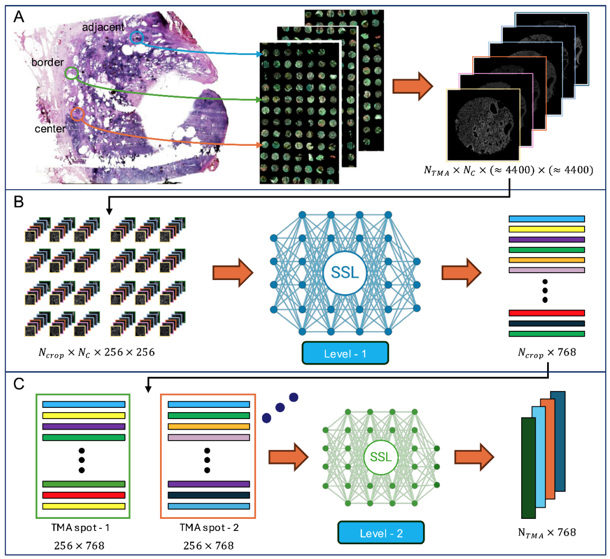

# SSL-Multiplexed-Imaging
Code for Atarsaikhan et al. (2025): ["Self-supervised learning enables unbiased patient characterization from multiplexed microscopy images"](https://www.biorxiv.org/content/10.1101/2025.03.05.640729v1).

The framework creates hierarchical representations of multiplexed immunofluorescence images from tissue microarray (TMA) cancer samples using self-supervised learning (SSL) backbones.
It operates on two levels:
- Level 1: Small patch crops from the original TMA spot images (~4000 × ~4000 pixels) are encoded. [DINO](https://openaccess.thecvf.com/content/ICCV2021/html/Caron_Emerging_Properties_in_Self-Supervised_Vision_Transformers_ICCV_2021_paper), [MAE](https://openaccess.thecvf.com/content/CVPR2022/html/He_Masked_Autoencoders_Are_Scalable_Vision_Learners_CVPR_2022_paper), [SIMCLR](https://arxiv.org/abs/2002.05709), and [VICRegL](https://arxiv.org/abs/2210.01571) methods are used.
- Level 2: The patch-level feature representations are aggregated using an SSL method to generate a single feature representation for each TMA spot. [DINO](https://openaccess.thecvf.com/content/ICCV2021/html/Caron_Emerging_Properties_in_Self-Supervised_Vision_Transformers_ICCV_2021_paper) and [MAE](https://openaccess.thecvf.com/content/CVPR2022/html/He_Masked_Autoencoders_Are_Scalable_Vision_Learners_CVPR_2022_paper) methods are used.

The resulting feature representations can be further aggregated to match patients' clinical records.

Each subdirectory contains one method.



#### Requirements

```python
torch==2.2.1
torchvision==0.17.1
lightly==1.4.26
pytorch-lightning==2.2
timm==0.9.12
h5py==3.7.0
```
and other regular libraries.

#### Training

- Please modify `chunked_h5_dataset.py` script according to your own dataset.
- Prerequisite for the dataset:
    - Crop the images into (256x256px) small patches.
    - The image should be log transformed if the dataset histogram is highly skewed.
- `main.py` is used to train a model. Training hyperparameters can be changed directly in that script.
    
#### Extracting embeddings

1. `get_embeddings.py` script extracts the feature representations. Feature representations are L2 normalized by default.

#### Creating attention maps

- Attention maps of one image can be created within `level_1_code/MAE_Lightly/AttentionMap.ipynb` notebook.
- The notebook utilizes one image as an input and creates twelve attention maps for that image.
- Trained models of Level-1 MAE method can be found in https://zenodo.org/records/15011375.

The code is based on Lightly SSL library: https://github.com/lightly-ai/lightly
